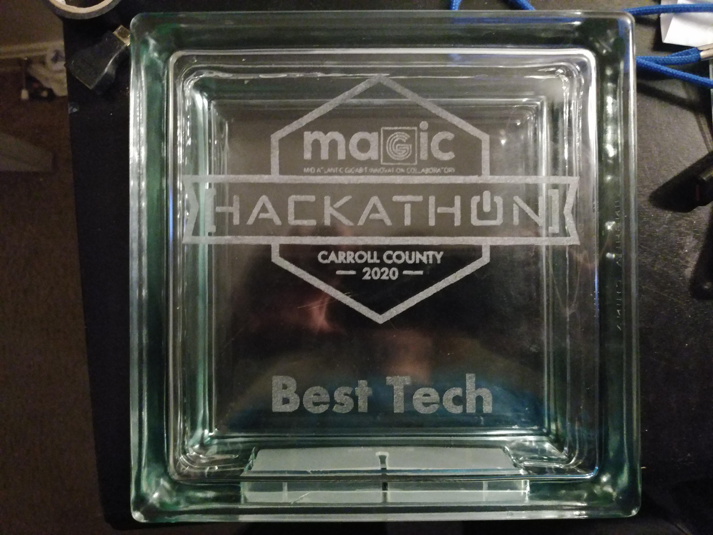

# magic-hackathon
## BitApprentice's repo for the Mid-Atlantic Gigabit Innovation Collaboratory (MAGIC) Hackathon 2020

### Our Idea
One of the [sponsors](https://cyai2024.org/) for the Hackathon wanted an easy way to connect them to students aged 16-21 who have an interest in cybersecurity.

### Rundown Of What We Did each Day

#### Day One
Friday we basically got everything setup,
We setup our text editors, setup syncthing for file syncing with our designer, made this repo.
It was the frontend developers first time using git so we originally setup different folders to work in.

#### Day Two
Saturday is when things got real,
Our designer dropped out of the Hackathon due to work time conflicts,
Thankfully there was a graphic design mentor there to help us with wireframes,
We got most of our tech demo done this day

#### Day Three
Sunday is when the stress levels rose to 110%
I couldn't get our search function working with the database properly, so I tried to use json instead which also failed,
I ended up faking the entire search function altogether,
The frontend developer was pulling double duty, trying to add css to all the other pages I made,
and working on our slides for the presentation.

### We ended up winning best tech!!

(I will link more pictures and our pitch video when it comes out then I'll archive the repo)
